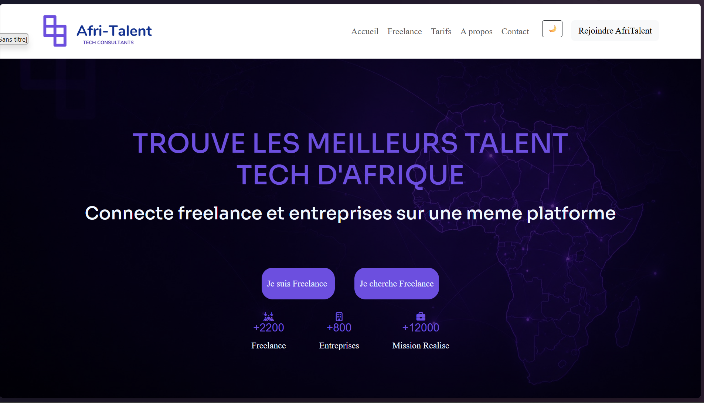
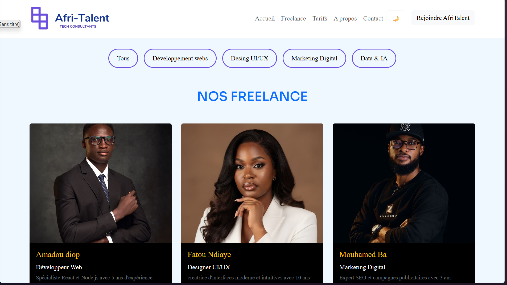
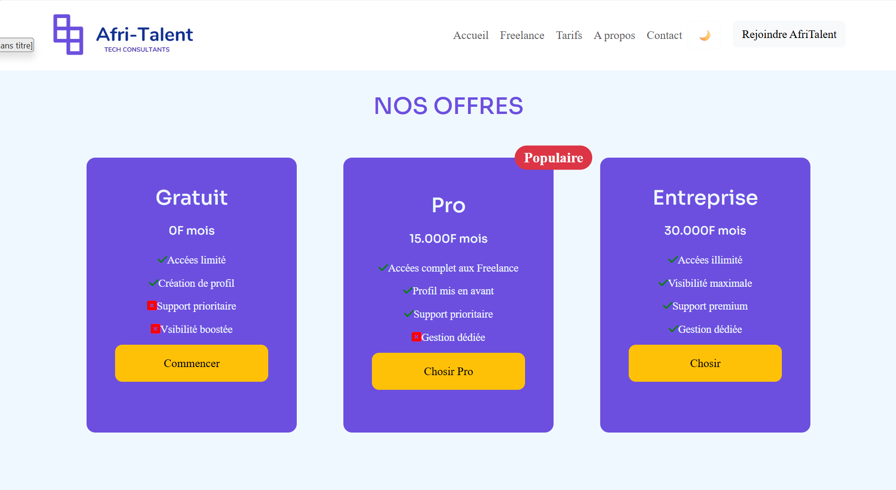
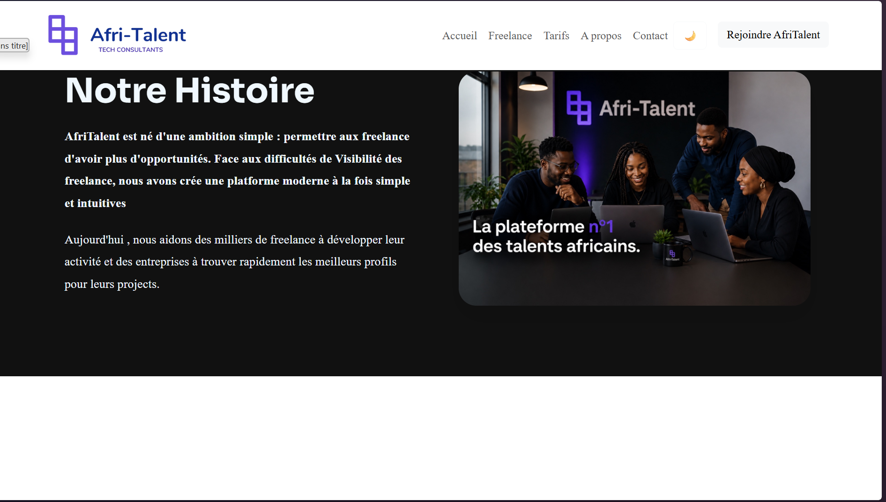
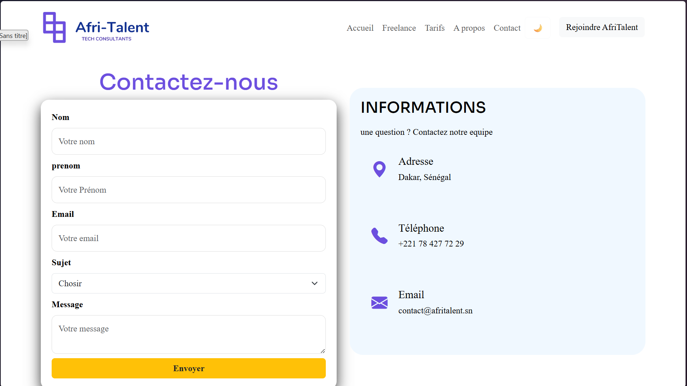

# AfriTalent

Projet fil rouge — Plateforme de mise en relation entre freelances africains et
clients.
Auteur : MOUHAMETH FALILOU THIANE
Promotion : L1 Web — ISI

# AfriTalent 

## Présentation du projet

AfriTalent est une plateforme web de mise en relation entre freelances et clients.
Le site permet de consulter des profils, comprendre le fonctionnement du service et contacter la plateforme.

Projet réalisé en HTML, CSS et JavaScript avec des fonctionnalités dynamiques et interactives.

---

## Lien du site:

👉 [falilouthiane28-cloud.github.io/THIANE-MOUHAMETH-FALILOU-AfriTalent](https://falilouthiane28-cloud.github.io/THIANE-MOUHAMETH-FALILOU-AfriTalent)

---

## Fonctionnalités

- Mode sombre / clair (localStorage)
- Navbar interactive au scroll
- Bouton retour en haut
- Animations au scroll (fade-in)
- Compteurs animés
- Filtrage des freelances
- Formulaire de contact avec validation JS
- Site responsive (mobile / tablette / desktop)

---

## Sections du site

- Accueil (Hero section)
- Comment ça marche (3 étapes)
- Freelances (avec filtres)
- Statistiques (compteurs animés)
- Contact (formulaire validé)

---

## Technologies utilisées

- HTML5
- CSS3 (Flexbox + Grid + Media Queries)
- JavaScript (DOM, Events, IntersectionObserver, LocalStorage)
- Git / GitHub
- GitHub Pages

---

## Arborescence du projet:

C:.
¦   .gitignore
¦   about.html
¦   arborescence.text
¦   contact.html
¦   freelance.html
¦   index.html
¦   readme.md
¦   tarifs.html
¦
+---css
¦       style.css
¦
+---docs
¦       THIANE_MOUHAMETH-FALILOU_Presentation.pptx
¦
+---image
¦       98ee45f03bf93e562e95656edccc9faa.jpg
¦       Accounting services Dubai, UAE.jpg
¦       AfriTalent.png
¦       Assistant Comptable.jpg
¦       bg-2.png
¦       bg-3.png
¦       bg-cta.jpg
¦       bg-site.jpg
¦       conception-graphique.png
¦       developpement-web.png
¦       digital-marketing (1).png
¦       h-t2.png
¦       ia.png
¦       logo.jpeg
¦       mk.jpg
¦       narcos.jpg
¦       Professional picture_.jpg
¦       profil dev.jpg
¦       profil f (1).jpg
¦       profil f (2).jpg
¦       profil f (3).jpg
¦       profil F (4).jpg
¦       profil F (5).jpg
¦       profil f 10.jpg
¦       profil f 2.0.jpg
¦       profil F.jpg
¦       profil f9.jpg
¦       profil final.jpg
¦       profil M (1).jpg
¦       profil M (2).jpg
¦       profil M (3).jpg
¦       profil M (4).jpg
¦       profil M (5).jpg
¦       profil M (6).jpg
¦       profil m 2.0 2.jpg
¦       profil m 2.0.jpg
¦       redaction-de-contenu.png
¦       serveur-cloud.png
¦       Tech business purple logo.PNG
¦       Tech_business_purple_logo-removebg-preview.png
¦       télécharger (9).jpg
¦       What Are the Benefits of Hiring a Local React Native Developer in Zambia_.jpg
¦
+---js
        main.js

---

## Points techniques importants

### JavaScript

- Mode sombre avec sauvegarde (localStorage)
- Filtrage dynamique des cartes freelances
- Animation des compteurs avec IntersectionObserver
- Apparition progressive des sections (fade-in)
- Validation complète du formulaire

### UX/UI

- Interface moderne et fluide
- Navigation intuitive
- Design responsive adapté à tous les écrans

---

## Difficultés rencontrées

- Gestion des animations au scroll
- Synchronisation du thème sombre
- Validation des formulaires sans rechargement
- Organisation du JavaScript

---

## Déploiement

- Hébergement via GitHub Pages
- Site entièrement fonctionnel
- Tests effectués sur mobile et desktop

---

## Captures d’écran

### Accueil

### Freelances

TARIFS

ABOUT

---

CONTACT

## Auteur

**Mouhameth Falilou Thiane**
Licence Informatique – 2025/2026
